# Airia Infrastructure Test Pod - Deployment Guide

## Overview

The Airia Infrastructure Test Pod validates that your environment is ready for the main Airia application deployment. It tests connectivity and configuration for essential Azure services and Kubernetes components.

**⏱️ Deployment Time: 5-10 minutes**

## What Does It Test?

### Required Services
- **Azure PostgreSQL Flexible Server** - Connection validation, database listing, extension verification
- **Azure Blob Storage** - Authentication, upload/download operations, container access
- **Azure OpenAI** - API connectivity, completion endpoints, embedding endpoints
- **Kubernetes Storage** - Storage class availability, PVC creation permissions, read/write operations

### Optional Services
- **Azure Document Intelligence** - Document processing API
- **Self-hosted OpenAI-compatible models** - Local LLM deployments
- **Self-hosted Llama-compatible models** - Ollama or similar
- **SSL Certificate Chains** - Validates complete certificate chains

## Prerequisites

- Kubernetes cluster (v1.19+)
- Helm 3.x
- kubectl configured for your cluster
- Ingress controller (nginx recommended)
- Azure services configured

## Quick Start (Recommended)

### Step 1: Gather Your Information

Collect these details from your Azure and infrastructure team:

**Azure PostgreSQL:**
- Server hostname: `your-server.postgres.database.azure.com`
- Database username and password
- Database name (usually `postgres`)

**Azure Blob Storage:**
- Storage account name
- Storage account key
- Container name

**Azure OpenAI:**
- Endpoint URL: `https://your-openai.openai.azure.com/`
- API key
- Deployment name (e.g., `gpt-35-turbo`)

**Azure Document Intelligence (optional):**
- Endpoint URL: `https://your-doc-intel.cognitiveservices.azure.com/`
- API key

**Your Domain Names:**
- Choose hostnames where the test pod will be accessible
- Ensure DNS points to your Kubernetes ingress

### Step 2: Create Configuration File

Create a file called `my-test-values.yaml`:

```yaml
config:
  # Change these login credentials!
  auth:
    username: "admin"
    password: "ChangeThisPassword123!"
    secretKey: "change-this-jwt-secret-key-to-something-random"
  
  # Configure only the services you want to test
  postgresql:
    enabled: true  # Set to false to skip
    host: "your-server.postgres.database.azure.com"
    database: "postgres"
    username: "your-username"
    password: "your-password"
  
  blobStorage:
    enabled: true  # Set to false to skip
    accountName: "yourstorageaccount"
    accountKey: "your-storage-key"
    containerName: "test-container"
    
  openai:
    enabled: true  # Set to false to skip
    endpoint: "https://your-openai.openai.azure.com/"
    apiKey: "your-openai-key"
    deploymentName: "gpt-35-turbo"
    
  documentIntelligence:
    enabled: false  # Set to true if you want to test this
    endpoint: "https://your-doc-intel.cognitiveservices.azure.com/"
    apiKey: "your-doc-intel-key"
    
  ssl:
    enabled: true  # Set to false to skip
    testUrls: "https://your-api-domain.com,https://your-app-domain.com"

# Update with your domain names
ingress:
  enabled: true
  className: nginx
  hosts:
    - host: airia-test.yourdomain.com
      paths:
        - path: /
          pathType: Prefix
    - host: infra-check.yourdomain.com
      paths:
        - path: /
          pathType: Prefix
  tls:
    - secretName: airia-test-pod-tls
      hosts:
        - airia-test.yourdomain.com
        - infra-check.yourdomain.com

# Optional: Resource limits
resources:
  limits:
    cpu: 500m
    memory: 512Mi
  requests:
    cpu: 100m
    memory: 256Mi
```

### Step 3: Deploy with Helm

```bash
# Deploy the test pod
helm install airia-test-pod ./helm/airia-test-pod -f my-test-values.yaml

# Wait for it to start (takes 1-2 minutes)
kubectl get pods -n airia-preprod -w
```

### Step 4: Access and Test

1. Open your browser and go to: `https://airia-test.yourdomain.com`
2. Login with the username/password from your values file
3. Click **"Run All Tests"**
4. Watch the real-time results

### Deployment Flow

```mermaid
flowchart TD
    Gather["📋 Gather Information<br/>• Azure credentials<br/>• Domain names<br/>• Service endpoints"] 
    
    Config["📝 Create Configuration<br/>• my-test-values.yaml<br/>• Authentication settings<br/>• Service configurations"]
    
    Deploy["🚀 Deploy with Helm<br/>helm install airia-test-pod"]
    
    Verify["✅ Verify Deployment<br/>kubectl get pods<br/>kubectl get ingress"]
    
    Access["🌐 Access Dashboard<br/>https://your-domain.com"]
    
    Test["🧪 Run Tests<br/>Click 'Run All Tests'"]
    
    Results["📊 Review Results<br/>• Passed services ✅<br/>• Failed services ❌<br/>• Remediation steps"]
    
    Fix["🔧 Fix Issues<br/>Follow remediation<br/>suggestions"]
    
    Retest["🔄 Re-run Tests<br/>Until all pass"]
    
    Complete["🎉 Ready for Production<br/>Contact Airia support"]
    
    Gather --> Config
    Config --> Deploy
    Deploy --> Verify
    Verify --> Access
    Access --> Test
    Test --> Results
    Results -->|Issues Found| Fix
    Fix --> Retest
    Retest --> Results
    Results -->|All Tests Pass| Complete
```



## Alternative Deployment Methods

### Using Docker (Development/Testing)

For local testing or simple deployments:

```bash
# Build the image (if needed)
docker build -t airia/test-pod:latest .

# Run with environment variables
docker run -d \
  --name airia-test-pod \
  -p 8080:8080 \
  -e AUTH_USERNAME=admin \
  -e AUTH_PASSWORD=changeme \
  -e POSTGRES_HOST=your-server.postgres.database.azure.com \
  -e POSTGRES_USER=your-username \
  -e POSTGRES_PASSWORD=your-password \
  -e BLOB_ACCOUNT_NAME=yourstorageaccount \
  -e BLOB_ACCOUNT_KEY=your-storage-key \
  -e OPENAI_ENDPOINT=https://your-openai.openai.azure.com/ \
  -e OPENAI_API_KEY=your-openai-key \
  airia/test-pod:latest

# Access at http://localhost:8080
```

### Using Raw Kubernetes Manifests

If you cannot use Helm:

```bash
# Create namespace
kubectl apply -f k8s/namespace.yaml

# Configure secrets (edit these files first!)
kubectl apply -f k8s/secret-example.yaml
kubectl apply -f k8s/postgres-secret-example.yaml
kubectl apply -f k8s/blob-secret-example.yaml
kubectl apply -f k8s/openai-secret-example.yaml

# Deploy application
kubectl apply -f k8s/rbac.yaml
kubectl apply -f k8s/configmap-example.yaml
kubectl apply -f k8s/deployment.yaml
kubectl apply -f k8s/service.yaml
kubectl apply -f k8s/ingress.yaml
```

## Understanding Test Results

| Status | Icon | Meaning |
|--------|------|---------|
| **Passed** | ✅ | Service is correctly configured |
| **Warning** | ⚠️ | Service works but has non-critical issues |
| **Failed** | ❌ | Service has critical issues that need fixing |
| **Timeout** | 🔄 | Service didn't respond in time |
| **Permission Denied** | 🚫 | Insufficient permissions |
| **Skipped** | ⏭️ | Optional service not configured (normal) |

### Test Execution Flow

```mermaid
flowchart TD
    Start(["User clicks 'Run Tests'"]) --> Auth{"Authentication Valid?"}
    Auth -->|No| Login["Redirect to Login"]
    Auth -->|Yes| Config{"Check Configuration"}
    
    Config -->|PostgreSQL Enabled| PG["Test PostgreSQL Connection"]
    Config -->|Blob Storage Enabled| Blob["Test Blob Storage"]
    Config -->|OpenAI Enabled| AI["Test OpenAI API"]
    Config -->|SSL Enabled| SSL["Test SSL Certificates"]
    Config -->|PVC Enabled| PVC["Test Kubernetes PVC"]
    
    PG --> PGResult{"Result"}
    Blob --> BlobResult{"Result"}
    AI --> AIResult{"Result"}
    SSL --> SSLResult{"Result"}
    PVC --> PVCResult{"Result"}
    
    PGResult -->|✅| PGPass["Mark as Passed"]
    PGResult -->|❌| PGFail["Mark as Failed + Remediation"]
    
    BlobResult -->|✅| BlobPass["Mark as Passed"]
    BlobResult -->|❌| BlobFail["Mark as Failed + Remediation"]
    
    AIResult -->|✅| AIPass["Mark as Passed"]
    AIResult -->|❌| AIFail["Mark as Failed + Remediation"]
    
    SSLResult -->|✅| SSLPass["Mark as Passed"]
    SSLResult -->|❌| SSLFail["Mark as Failed + Remediation"]
    
    PVCResult -->|✅| PVCPass["Mark as Passed"]
    PVCResult -->|❌| PVCFail["Mark as Failed + Remediation"]
    
    PGPass --> Summary["Generate Test Summary"]
    PGFail --> Summary
    BlobPass --> Summary
    BlobFail --> Summary
    AIPass --> Summary
    AIFail --> Summary
    SSLPass --> Summary
    SSLFail --> Summary
    PVCPass --> Summary
    PVCFail --> Summary
    
    Summary --> WebSocket["Send Real-time Updates"]
    WebSocket --> Dashboard["Update Dashboard"]
```



## Common Issues and Solutions

### PostgreSQL Connection Failed
```
Error: connection refused
Solutions: 
1. Verify firewall rules allow connection from cluster
2. Check if server allows connections from Azure services
3. Ensure SSL mode is set correctly
4. Verify hostname format: server.postgres.database.azure.com
```

### Blob Storage Authentication Failed
```
Error: 403 Forbidden
Solutions:
1. Verify account key is correct and not expired
2. Check if IP restrictions are blocking cluster
3. Ensure container exists and has proper permissions
4. Test account key with Azure Storage Explorer
```

### OpenAI API Errors
```
Error: 401 Unauthorized or 404 Not Found
Solutions:
1. Verify API key is correct
2. Check endpoint format: https://name.openai.azure.com/
3. Ensure deployment name matches your Azure OpenAI deployment
4. Check API version compatibility
```

### PVC Creation Failed
```
Error: forbidden: cannot create persistentvolumeclaims
Solutions:
1. Verify RBAC permissions (automatic with Helm)
2. Check if storage class exists: kubectl get storageclass
3. Verify namespace resource quotas
```

### SSL Certificate Issues
```
Error: certificate chain incomplete
Solutions:
1. Ensure certificate chain is complete
2. Check certificate expiration dates
3. Verify hostname matches certificate
4. Test with: openssl s_client -connect hostname:443
```

## Configuration Reference

### Complete Values File Documentation

Below is a comprehensive reference for all configuration options available in your `values.yaml` file:

```yaml
# =============================================================================
# AUTHENTICATION CONFIGURATION
# =============================================================================
config:
  auth:
    # Web UI login credentials (REQUIRED)
    username: "admin"                                    # Default: "admin"
    password: "ChangeThisPassword123!"                   # MUST CHANGE - Web UI password
    secretKey: "change-this-jwt-secret-key"             # MUST CHANGE - JWT signing key (min 32 chars)

# =============================================================================  
# SERVICE TEST CONFIGURATIONS
# =============================================================================
  
  # PostgreSQL Database Testing
  postgresql:
    enabled: true                                        # Enable/disable PostgreSQL tests
    host: "your-server.postgres.database.azure.com"     # FQDN of PostgreSQL server
    port: 5432                                          # Default: 5432
    database: "postgres"                                # Target database name
    username: "your-username"                           # Database username
    password: "your-password"                           # Database password
    sslMode: "require"                                  # SSL mode: disable|allow|prefer|require|verify-ca|verify-full
    connectTimeout: 30                                  # Connection timeout in seconds
    
  # Azure Blob Storage Testing  
  blobStorage:
    enabled: true                                       # Enable/disable Blob Storage tests
    accountName: "yourstorageaccount"                   # Storage account name (without .blob.core.windows.net)
    accountKey: "your-storage-key"                      # Primary or secondary access key
    containerName: "test-container"                     # Container name for test operations
    timeout: 30                                         # Operation timeout in seconds
    
  # Azure OpenAI Testing
  openai:
    enabled: true                                       # Enable/disable OpenAI tests
    endpoint: "https://your-openai.openai.azure.com/"  # OpenAI endpoint URL (must end with /)
    apiKey: "your-openai-key"                          # OpenAI API key
    deploymentName: "gpt-35-turbo"                     # Model deployment name in Azure OpenAI
    apiVersion: "2024-02-15-preview"                   # API version (default: 2024-02-15-preview)
    maxTokens: 100                                     # Max tokens for test completions
    temperature: 0.7                                   # Sampling temperature (0.0-2.0)
    timeout: 60                                        # Request timeout in seconds
    
  # Azure Document Intelligence (Optional)
  documentIntelligence:
    enabled: false                                      # Enable/disable Document Intelligence tests
    endpoint: "https://your-doc-intel.cognitiveservices.azure.com/"  # Doc Intel endpoint
    apiKey: "your-doc-intel-key"                       # Document Intelligence API key
    timeout: 60                                        # Request timeout in seconds
    
  # Self-hosted Llama Models (Optional)
  llama:
    enabled: false                                      # Enable/disable Llama model tests
    baseUrl: "http://localhost:8000/v1/"               # Llama server base URL (must end with /v1/)
    modelName: "llama2-7b"                             # Model name to test
    apiKey: "your-key-if-needed"                       # API key (optional for some deployments)
    timeout: 60                                        # Request timeout in seconds
    maxTokens: 100                                     # Max tokens for test completions
    
  # OpenAI-Compatible APIs (Optional)
  openaiCompatible:
    enabled: false                                      # Enable/disable OpenAI-compatible tests
    baseUrl: "http://your-server:8000/v1/"             # API base URL (must end with /v1/)
    modelName: "llama-2-7b-chat"                       # Model name (must contain "llama" for detection)
    apiKey: "your-api-key"                             # API key (if required)
    timeout: 60                                        # Request timeout in seconds
    
  # SSL Certificate Chain Testing (Enhanced - like openssl s_client -showcerts)
  ssl:
    enabled: true                                       # Enable/disable SSL certificate tests
    testUrls: "https://api.domain.com,https://app.domain.com"  # Comma-separated URLs to test
    timeout: 30                                        # Connection timeout in seconds
    verifyChain: true                                  # Verify complete certificate chain presence
    checkExpiry: true                                  # Check certificate expiration dates
    warningDays: 30                                    # Days before expiration to show warnings
    # NEW: Detects missing intermediate certificates (common SSL misconfiguration)
    # NEW: Validates certificate chain completeness like "openssl s_client -showcerts"
    # NEW: Identifies self-signed certificates and CA certificate issues
    
  # Kubernetes Storage Testing
  pvc:
    enabled: true                                       # Enable/disable PVC tests (default: true)
    storageClass: ""                                   # Storage class name (empty = default)
    size: "1Gi"                                        # PVC size for test (default: 1Gi)
    accessMode: "ReadWriteOnce"                        # Access mode: ReadWriteOnce|ReadOnlyMany|ReadWriteMany
    timeout: 120                                       # PVC creation timeout in seconds

# =============================================================================
# ENHANCED SSL CERTIFICATE CHAIN VALIDATION
# =============================================================================

# The SSL test now provides comprehensive certificate chain analysis similar to:
# "openssl s_client -connect domain.com:443 -showcerts"
#
# What the enhanced SSL test detects:
# ✓ Missing intermediate certificates (common misconfiguration)
# ✓ Self-signed certificates  
# ✓ Certificate chain completeness
# ✓ Certificate Authority (CA) flag validation
# ✓ Certificate chain continuity (each cert signed by next)
# ✓ Hostname/SAN matching
# ✓ Certificate expiration with configurable warnings
# ✓ Weak signature algorithms (MD5, SHA1)
#
# Common SSL issues detected:
# - "Certificate chain appears incomplete - no intermediate certificates found"
# - "This may cause SSL/TLS validation failures for some clients" 
# - Server certificates marked as CA certificates (security issue)
# - Chain breaks (certificate not signed by expected issuer)
# - Self-signed certificates in production environments
#
# Environment variables for SSL testing:
# SSL_TEST_URLS=https://api.domain.com,https://app.domain.com
# SSL_CONNECT_TIMEOUT=10
# SSL_WARNING_DAYS=30

# =============================================================================
# KUBERNETES DEPLOYMENT CONFIGURATION
# =============================================================================

# Container Image Settings
image:
  repository: "airia/test-pod"                          # Container image repository
  tag: "latest"                                        # Image tag (default: latest)
  pullPolicy: "Always"                                # Pull policy: Always|IfNotPresent|Never

# Service Account
serviceAccount:
  create: true                                         # Create service account (default: true)
  name: ""                                            # Service account name (empty = auto-generated)
  annotations: {}                                     # Additional annotations

# Pod Security Context  
podSecurityContext:
  fsGroup: 2000                                       # File system group ID
  runAsNonRoot: true                                  # Run as non-root user
  runAsUser: 1000                                     # User ID to run as
  runAsGroup: 3000                                    # Group ID to run as

# Container Security Context
securityContext:
  allowPrivilegeEscalation: false                     # Prevent privilege escalation
  readOnlyRootFilesystem: true                        # Read-only root filesystem
  runAsNonRoot: true                                  # Run as non-root
  capabilities:
    drop:
      - ALL                                           # Drop all capabilities

# Resource Limits and Requests
resources:
  limits:
    cpu: "500m"                                       # CPU limit (millicores)
    memory: "512Mi"                                   # Memory limit
  requests:
    cpu: "100m"                                       # CPU request (millicores)
    memory: "256Mi"                                   # Memory request

# Pod Disruption Budget
podDisruptionBudget:
  enabled: false                                      # Enable PDB (default: false)
  minAvailable: 1                                     # Minimum available pods

# Horizontal Pod Autoscaler
autoscaling:
  enabled: false                                      # Enable HPA (default: false)
  minReplicas: 1                                      # Minimum replicas
  maxReplicas: 3                                      # Maximum replicas
  targetCPUUtilizationPercentage: 80                 # CPU target percentage

# Node Selection
nodeSelector: {}                                      # Node selector labels
tolerations: []                                       # Pod tolerations
affinity: {}                                         # Pod affinity/anti-affinity

# =============================================================================
# NETWORKING CONFIGURATION
# =============================================================================

# Service Configuration
service:
  type: "ClusterIP"                                   # Service type: ClusterIP|NodePort|LoadBalancer
  port: 80                                           # Service port
  targetPort: 8080                                   # Container port
  annotations: {}                                    # Service annotations

# Ingress Configuration
ingress:
  enabled: true                                      # Enable ingress (default: true)
  className: "nginx"                                 # Ingress class name
  annotations: {}                                    # Additional ingress annotations
  hosts:
    - host: "airia-test.yourdomain.com"             # Primary hostname
      paths:
        - path: "/"                                 # Path pattern
          pathType: "Prefix"                        # Path type: Exact|Prefix|ImplementationSpecific
    - host: "infra-check.yourdomain.com"            # Secondary hostname (optional)
      paths:
        - path: "/"
          pathType: "Prefix"
  tls:
    - secretName: "airia-test-pod-tls"              # TLS secret name
      hosts:
        - "airia-test.yourdomain.com"               # Hostnames covered by this cert
        - "infra-check.yourdomain.com"

# Network Policies (Optional)
networkPolicy:
  enabled: false                                     # Enable network policies
  ingress: []                                       # Ingress rules
  egress: []                                        # Egress rules

# =============================================================================
# MONITORING AND OBSERVABILITY  
# =============================================================================

# Health Check Configuration
healthCheck:
  enabled: true                                      # Enable health checks (default: true)
  path: "/health"                                   # Health check endpoint
  port: 8080                                        # Health check port
  initialDelaySeconds: 30                           # Initial delay before first check
  periodSeconds: 10                                 # Check interval
  timeoutSeconds: 5                                 # Request timeout
  successThreshold: 1                               # Success threshold
  failureThreshold: 3                               # Failure threshold

# Readiness Probe
readinessProbe:
  enabled: true                                      # Enable readiness probe (default: true)
  path: "/ready"                                    # Readiness endpoint
  initialDelaySeconds: 10                           # Initial delay
  periodSeconds: 5                                  # Check interval

# Prometheus Metrics (Optional)
metrics:
  enabled: false                                     # Enable Prometheus metrics
  port: 9090                                        # Metrics port
  path: "/metrics"                                  # Metrics endpoint

# =============================================================================
# PERSISTENCE AND STORAGE
# =============================================================================

# Persistent Volume for Temporary Files (Optional)
persistence:
  enabled: false                                     # Enable persistent storage
  size: "1Gi"                                       # Volume size
  storageClass: ""                                  # Storage class (empty = default)
  accessMode: "ReadWriteOnce"                       # Access mode

# Temporary Storage
tmpStorage:
  enabled: true                                      # Enable temporary storage (default: true)
  size: "1Gi"                                       # Temporary storage size

# =============================================================================
# ADVANCED CONFIGURATION
# =============================================================================

# Pod Annotations and Labels
podAnnotations: {}                                   # Additional pod annotations
podLabels: {}                                       # Additional pod labels

# Environment Variables
extraEnvVars: []                                    # Additional environment variables
# Example:
# extraEnvVars:
#   - name: "CUSTOM_VAR"
#     value: "custom-value"

# Volume Mounts
extraVolumeMounts: []                               # Additional volume mounts
extraVolumes: []                                    # Additional volumes

# Init Containers (Optional)
initContainers: []                                  # Init containers

# Sidecar Containers (Optional)  
sidecars: []                                        # Sidecar containers

# Pod Priority
priorityClassName: ""                               # Priority class name

# Runtime Class
runtimeClassName: ""                                # Runtime class name

# DNS Configuration
dnsPolicy: "ClusterFirst"                           # DNS policy
dnsConfig: {}                                       # DNS configuration

# =============================================================================
# DEBUGGING AND DEVELOPMENT
# =============================================================================

# Debug Mode
debug:
  enabled: false                                     # Enable debug logging
  level: "INFO"                                     # Log level: DEBUG|INFO|WARN|ERROR

# Development Mode
development:
  enabled: false                                     # Enable development mode
  hotReload: false                                  # Enable hot reload (if supported)
```

### Configuration Examples

**Minimal Configuration (Required Services Only):**
```yaml
config:
  auth:
    username: "admin"
    password: "SecurePassword123!"
    secretKey: "your-random-jwt-secret-key-32-chars-min"
  postgresql:
    enabled: true
    host: "your-server.postgres.database.azure.com"
    username: "postgres_user"
    password: "postgres_password"
  blobStorage:
    enabled: true
    accountName: "yourstorageaccount"
    accountKey: "your-storage-key"
    containerName: "test-container"
  openai:
    enabled: true
    endpoint: "https://your-openai.openai.azure.com/"
    apiKey: "your-openai-key"
    deploymentName: "gpt-35-turbo"

ingress:
  enabled: true
  className: nginx
  hosts:
    - host: airia-test.yourdomain.com
      paths:
        - path: /
          pathType: Prefix
```

**Production Configuration with Security:**
```yaml
config:
  auth:
    username: "admin"
    password: "ComplexProductionPassword123!"
    secretKey: "production-jwt-secret-key-should-be-very-long-and-random"

# Reference existing secrets instead of inline values
postgresql:
  enabled: true
  host: "prod-postgres.postgres.database.azure.com"
  existingSecret: "postgres-credentials"
  usernameKey: "username"
  passwordKey: "password"

resources:
  limits:
    cpu: "1000m"
    memory: "1Gi"
  requests:
    cpu: "200m"
    memory: "512Mi"

podSecurityContext:
  runAsNonRoot: true
  runAsUser: 1000
  fsGroup: 2000

securityContext:
  allowPrivilegeEscalation: false
  readOnlyRootFilesystem: true
  runAsNonRoot: true
  capabilities:
    drop:
      - ALL

networkPolicy:
  enabled: true
  ingress:
    - from:
        - namespaceSelector:
            matchLabels:
              name: ingress-nginx
```

## Advanced Configuration

### Multiple Hostname Support

The ingress supports up to 5 different hostnames:

```yaml
ingress:
  hosts:
    - host: test.public.company.com
      paths:
        - path: /
          pathType: Prefix
    - host: readiness.internal.company.com
      paths:
        - path: /
          pathType: Prefix
    - host: infra-check.dev.company.com
      paths:
        - path: /
          pathType: Prefix
  tls:
    - hosts:
        - test.public.company.com
      secretName: public-tls
    - hosts:
        - readiness.internal.company.com
        - infra-check.dev.company.com
      secretName: internal-tls
```

### Optional Service Configuration

Enable optional services by setting `enabled: true`:

```yaml
config:
  # Azure Document Intelligence
  documentIntelligence:
    enabled: true
    endpoint: "https://your-doc-intel.cognitiveservices.azure.com/"
    apiKey: "your-api-key"
  
  # Self-hosted Llama models
  llama:
    enabled: true
    baseUrl: "http://localhost:8000/v1/"
    modelName: "llama2-7b"
    apiKey: "your-key-if-needed"  # optional
  
  # OpenAI-compatible APIs
  openaiCompatible:
    enabled: true
    baseUrl: "http://your-llama-server:8000/v1/"
    modelName: "llama-2-7b-chat"  # Must contain "llama" in name
```

## Monitoring and Troubleshooting

### Health Check
```bash
curl -k https://your-domain.com/health
```

Expected response:
```json
{
  "status": "healthy",
  "timestamp": "2024-01-01T12:00:00.000000",
  "version": "1.0.0"
}
```

### View Logs
```bash
# Follow application logs
kubectl logs -f -n airia-preprod -l app.kubernetes.io/name=airia-test-pod

# Check pod status and events
kubectl describe pod -n airia-preprod -l app.kubernetes.io/name=airia-test-pod

# Check ingress status
kubectl get ingress -n airia-preprod
kubectl describe ingress -n airia-preprod airia-test-pod
```

### Common Troubleshooting Commands

**Pod Won't Start:**
```bash
kubectl describe pod -n airia-preprod -l app.kubernetes.io/name=airia-test-pod
kubectl logs -n airia-preprod -l app.kubernetes.io/name=airia-test-pod
```

**Can't Access Web UI:**
```bash
# Test with port-forward
kubectl port-forward -n airia-preprod svc/airia-test-pod 8080:80
# Then open http://localhost:8080

# Check ingress controller
kubectl get pods -n ingress-nginx
```

**Authentication Issues:**
```bash
# Verify secret exists
kubectl get secret -n airia-preprod -l app.kubernetes.io/name=airia-test-pod
```

### API Access (Alternative to Web UI)

```bash
# Get authentication token
TOKEN=$(curl -X POST https://your-domain.com/token \
  -H "Content-Type: application/x-www-form-urlencoded" \
  -d "username=admin&password=your-password" | jq -r '.access_token')

# Run all tests
curl -H "Authorization: Bearer $TOKEN" https://your-domain.com/api/tests/run-all

# Run specific test
curl -H "Authorization: Bearer $TOKEN" https://your-domain.com/api/tests/postgres

# Get results
curl -H "Authorization: Bearer $TOKEN" https://your-domain.com/api/tests/results
```

## Security Considerations

1. **Change Default Credentials** - Never use default passwords in production
2. **Use Kubernetes Secrets** - Store sensitive data in secrets, not ConfigMaps
3. **Enable TLS** - Always use HTTPS for external access
4. **Network Policies** - Implement to restrict traffic if needed
5. **RBAC** - The pod uses minimal required permissions
6. **Regular Updates** - Keep the test pod image updated

## Helm Management

### Common Helm Operations

```bash
# Check installation status
helm list -n airia-preprod

# View current configuration
helm get values airia-test-pod -n airia-preprod

# Upgrade to new version
helm upgrade airia-test-pod ./helm/airia-test-pod -f my-test-values.yaml

# Rollback if needed
helm rollback airia-test-pod -n airia-preprod

# Uninstall
helm uninstall airia-test-pod -n airia-preprod
```

### Using External Secrets

For production environments, store secrets externally:

```bash
# Create secrets manually
kubectl create secret generic azure-credentials \
  --from-literal=postgres-password='your-password' \
  --from-literal=blob-key='your-key' \
  --from-literal=openai-key='your-key' \
  -n airia-preprod

# Reference in values.yaml
azure:
  postgres:
    existingSecret: azure-credentials
    passwordKey: postgres-password
```

## Cleanup

### Remove Test Pod
```bash
# Helm installation
helm uninstall airia-test-pod -n airia-preprod

# Raw Kubernetes manifests
kubectl delete -f k8s/ -n airia-preprod

# Docker container
docker stop airia-test-pod && docker rm airia-test-pod

# Optional: Remove namespace
kubectl delete namespace airia-preprod
```

## Next Steps

After successful validation:

1. **Address any failed tests** using the remediation suggestions
2. **Re-run tests** until all required services pass
3. **Save your working configuration** for reference
4. **Contact Airia support** to proceed with main application deployment

## Support

When contacting support, please include:
- Screenshot of test results
- Pod logs: `kubectl logs -n airia-preprod -l app.kubernetes.io/name=airia-test-pod`
- Your configuration (with sensitive data redacted)

---

**Architecture Overview:**

```mermaid
graph LR
    Customer["🏢 Customer Network<br/>• SSL Certs<br/>• DNS<br/>• Firewalls"]
    
    TestPod["☸️ Test Pod (Kubernetes)<br/>• Web Dashboard<br/>• Test Engine<br/>• WebSocket<br/>• RBAC"]
    
    Azure["☁️ Azure Services<br/>• PostgreSQL<br/>• Blob Storage<br/>• OpenAI<br/>• Doc Intel"]
    
    Customer <--> TestPod
    TestPod <--> Azure
```



Made with ❤️ by the Airia Team