# Airia Infrastructure Test Pod

A comprehensive Kubernetes application that validates infrastructure readiness before deploying production applications. This tool tests connectivity to essential Azure services and provides actionable feedback for resolving common configuration issues.

[](https://github.com/davidpacold/airia-test-pod/releases)
[](https://github.com/davidpacold/airia-test-pod/pkgs/container/airia-test-pod)
[](https://hub.docker.com/r/davidpacold/airia-test-pod)
[](https://github.com/davidpacold/airia-test-pod/actions)

## 🚀 Quick Start

### Prerequisites
- Kubernetes cluster with `airia-preprod` namespace (created automatically by Helm)
- Ingress Controller (if using ingress):
  
  **NGINX Ingress Controller:**
  ```bash
  helm repo add ingress-nginx https://kubernetes.github.io/ingress-nginx
  helm install ingress-nginx ingress-nginx/ingress-nginx --create-namespace --namespace ingress-nginx
  ```
  
  **Azure Application Gateway Ingress Controller (AGIC):**
  ```bash
  # Follow Azure documentation to set up AGIC
  # Then use: --set ingress.className="azure-application-gateway"
  ```

### Using Helm Repository (Recommended)

```bash
# 1. Add the Helm repository
helm repo add airia-test-pod https://davidpacold.github.io/airia-test-pod/
helm repo update

# 2. Create your configuration
cat > my-test-values.yaml << EOF
config:
  auth:
    username: "admin"
    password: "YourSecurePassword123!"
    secretKey: "your-random-jwt-secret-key"
  # Add your service configurations here...
EOF

# 3. Install (always gets the latest version)
helm install airia-test-pod airia-test-pod/airia-test-pod -f my-test-values.yaml

# 4. Access the dashboard
kubectl port-forward -n airia-preprod svc/airia-test-pod 8080:80
# Open http://localhost:8080
```

### Alternative: Direct GitHub Release

```bash
# Install specific version from GitHub release
helm install airia-test-pod https://github.com/davidpacold/airia-test-pod/releases/download/v1.0.1/airia-test-pod-1.0.1.tgz -f my-test-values.yaml
```

### Using Local Source

```bash
# 1. Clone the repository
git clone https://github.com/davidpacold/airia-test-pod.git
cd airia-test-pod

# 2. Create configuration and deploy
helm install airia-test-pod ./helm/airia-test-pod -f my-test-values.yaml
```

**⏱️ Complete deployment takes 5-10 minutes**

## 📋 What Does It Test?

**🎯 7 Comprehensive Infrastructure Tests Available:**

### Database Services 🗄️
- **Azure PostgreSQL** - Connection validation, database listing, extension verification  
- **Apache Cassandra** - Cluster health, keyspace enumeration, query execution, replication checks

### Storage Services 💾
- **Azure Blob Storage** - Authentication, upload/download operations, container access
- **Amazon S3 / MinIO** - S3-compatible storage testing with credentials validation

### AI/ML Services 🤖
- **Azure OpenAI** - API connectivity, completion endpoints, embedding endpoints
- **Azure Document Intelligence** - Document processing API validation
- **Custom Embedding Models** - OpenAI-compatible embedding endpoints

### Infrastructure Services 🏗️
- **Kubernetes Storage (PVC)** - Storage class availability, PVC creation permissions
- **SSL Certificate Validation** - Full certificate chain analysis
  - Detects missing intermediate certificates
  - Validates certificate chain completeness  
  - Checks certificate expiration and hostname matching
  - Identifies SSL misconfigurations that cause client failures

### Optional Services ⚙️
- **Self-hosted OpenAI-compatible models** - Local LLM deployments  
- **Self-hosted Llama models** - Ollama or similar

## 📖 Documentation

- **[DEPLOYMENT_GUIDE.md](DEPLOYMENT_GUIDE.md)** - Complete deployment and configuration guide
- **[Helm Chart README](helm/airia-test-pod/README.md)** - Helm-specific configuration options

## 🔧 Configuration Example

Create `my-test-values.yaml` with your configuration:

```yaml
config:
  auth:
    username: "admin"
    password: "ChangeThisPassword123!"  # REQUIRED: Change this
    secretKey: "your-secret-jwt-key"    # REQUIRED: Generate secure key (openssl rand -hex 32)
    
  # PostgreSQL Testing (optional)
  postgresql:
    enabled: true
    host: "your-server.postgres.database.azure.com"
    port: "5432"
    database: "postgres"
    sslmode: "require"
    username: "your-username"
    password: "your-password"
    
  # Azure Blob Storage Testing (optional)
  blobStorage:
    enabled: true
    accountName: "yourstorageaccount"
    accountKey: "your-storage-key"
    containerName: "test-container"
    
  # Azure OpenAI Testing (optional)
  openai:
    enabled: true
    endpoint: "https://your-openai.openai.azure.com/"
    apiKey: "your-openai-key"
    deploymentName: "gpt-35-turbo"
    embeddingDeployment: "text-embedding-ada-002"  # Optional

  # Additional optional services (see full example for details):
  # cassandra, documentIntelligence, ssl, kubernetes, minio, s3, embeddings

ingress:
  enabled: true
  className: "nginx"  # Use "azure-application-gateway" for Azure App Gateway
  hosts:
    - host: airia-test.yourdomain.com  # CHANGE THIS
      paths:
        - path: /
          pathType: Prefix
    # Add up to 5 hostnames with individual TLS certificates:
    # - host: airia-test-secondary.yourdomain.com
    #   paths:
    #     - path: /
    #       pathType: Prefix
  
  # TLS configuration (customer-managed certificates, SSL termination at ingress)
  tls:
    - secretName: airia-test-tls  # CHANGE THIS to your TLS secret
      hosts:
        - airia-test.yourdomain.com  # CHANGE THIS
    # - secretName: secondary-tls
    #   hosts:
    #     - airia-test-secondary.yourdomain.com

# For Azure Application Gateway users, uncomment and modify:
# ingress:
#   className: "azure-application-gateway"
#   annotations:
#     kubernetes.io/ingress.class: azure/application-gateway
#     appgw.ingress.kubernetes.io/ssl-redirect: "false"
```

## 📚 Complete Configuration Reference

**For all 7 infrastructure tests with examples:**

### 🎯 **[📄 Complete Example: `Test deploy/values-example.yaml`](Test%20deploy/values-example.yaml)**
**→ This file contains examples for ALL 7 tests including the new Cassandra test!**

### Additional References:
- **All Configuration Options**: [`helm/airia-test-pod/values.yaml`](helm/airia-test-pod/values.yaml) - Every available setting with defaults
- **Deployment Guide**: [`DEPLOYMENT_GUIDE.md`](DEPLOYMENT_GUIDE.md) - Step-by-step setup instructions
- **Helm Guide**: [`helm/airia-test-pod/README.md`](helm/airia-test-pod/README.md) - Helm-specific details

## 🔍 Understanding Results

| Status | Icon | Meaning |
|--------|------|---------|
| **Passed** | ✅ | Service is correctly configured |
| **Failed** | ❌ | Service has critical issues that need fixing |
| **Skipped** | ⏭️ | Optional service not configured (normal) |

### 🔧 Intelligent Error Detection & Remediation

The test pod automatically detects common infrastructure issues and provides specific remediation steps:

- **SSL Certificate Issues**: Missing intermediate certificates, expired certs, hostname mismatches
- **PostgreSQL Problems**: Missing extensions (pgvector, uuid-ossp), connection issues, authentication failures
- **Storage Class Errors**: Missing storage classes, insufficient permissions, PVC creation failures
- **Azure Service Issues**: Incorrect endpoints, authentication problems, network connectivity
- **LLM Model Access**: Model not found, quota exceeded, API version mismatches

Each failed test includes:
- Detailed error description
- Root cause analysis
- Step-by-step remediation instructions
- Links to relevant documentation

## 🛠️ Alternative Deployments

### Docker (Development/Testing)

**Available Container Registries:**
- GitHub Container Registry: `ghcr.io/davidpacold/airia-test-pod:latest`
- Docker Hub: `davidpacold/airia-test-pod:latest`
- Azure Container Registry: `yourregistry.azurecr.io/airia-test-pod:latest` (self-hosted)

```bash
# Using GitHub Container Registry (recommended)
docker run -d -p 8080:8080 \
  -e AUTH_USERNAME=admin -e AUTH_PASSWORD=changeme \
  -e POSTGRES_HOST=your-server.postgres.database.azure.com \
  -e POSTGRES_USER=your-username -e POSTGRES_PASSWORD=your-password \
  ghcr.io/davidpacold/airia-test-pod:latest

# Or using Docker Hub
docker run -d -p 8080:8080 \
  -e AUTH_USERNAME=admin -e AUTH_PASSWORD=changeme \
  davidpacold/airia-test-pod:latest
```

**Available Tags:**
- `latest` - Most recent stable release
- `v1.0.x` - Specific version tags
- `main` - Latest development build

### Raw Kubernetes Manifests
```bash
kubectl apply -f k8s/namespace.yaml
kubectl apply -f k8s/secret-example.yaml  # Edit first!
kubectl apply -f k8s/deployment.yaml
kubectl apply -f k8s/service.yaml
kubectl apply -f k8s/ingress.yaml
```

## 📊 Features

- **Real-time Dashboard** - Interactive web interface with live updates
- **WebSocket Integration** - Real-time test progress and status updates  
- **JWT Authentication** - Secure login system
- **Multiple Deployment Options** - Helm, Kubernetes, Docker
- **Comprehensive Testing** - 6 different infrastructure tests
- **Production Ready** - RBAC, security contexts, resource limits

## 🏗️ Architecture

```mermaid
graph TB
    Browser["🖥️ Web Browser<br/>• Dashboard UI<br/>• WebSocket<br/>• Real-time Updates"]
    
    FastAPI["⚡ FastAPI App<br/>• Authentication<br/>• Test Engine<br/>• WebSocket<br/>• API Endpoints"]
    
    Azure["☁️ Azure Services<br/>• PostgreSQL<br/>• Blob Storage<br/>• OpenAI<br/>• Doc Intel"]
    
    K8s["☸️ Kubernetes<br/>• Storage (PVC)<br/>• RBAC<br/>• Secrets<br/>• ConfigMaps"]
    
    Browser <--> FastAPI
    FastAPI <--> Azure
    FastAPI --> K8s
```



## 🔒 Security

- JWT authentication with configurable credentials
- Kubernetes RBAC with minimal required permissions
- Secure secret management via Kubernetes secrets
- Multi-stage Docker builds with security best practices
- **SSL/TLS Configuration**: Customer-managed certificates with SSL termination at ingress level
  - Pod accepts HTTP traffic internally (standard Kubernetes pattern)
  - TLS certificates configured at ingress controller
  - Support for multiple hostnames with individual certificates
- Enhanced SSL certificate chain validation for external services

## 🆘 Troubleshooting

### Common Issues

**Connection Failed:**
- Check firewall rules and network connectivity
- Verify service endpoints and credentials
- Review Azure service configurations

**Permission Denied (PVC tests):**
- RBAC is configured automatically with Helm
- Manual deployments need proper service account permissions

**View Logs:**
```bash
kubectl logs -f -n airia-preprod -l app.kubernetes.io/name=airia-test-pod
```

## 📦 Project Structure

```
airia_test_pod/
├── app/                    # Application source code
│   ├── auth.py            # JWT authentication
│   ├── main.py            # FastAPI application
│   ├── models.py          # Data models
│   └── tests/             # Test implementations
├── templates/             # HTML templates
├── static/               # CSS and static assets
├── k8s/                  # Kubernetes manifests
├── helm/airia-test-pod/  # Helm chart
├── Dockerfile            # Container definition
├── requirements.txt      # Python dependencies
└── DEPLOYMENT_GUIDE.md   # Complete deployment guide
```

## 🤝 Support

- **Documentation:** See [DEPLOYMENT_GUIDE.md](DEPLOYMENT_GUIDE.md) for detailed instructions
- **Issues:** When contacting support, include test results and pod logs
- **Email:** support@airia.io

## ✅ Project Status: COMPLETE

All requirements successfully implemented:
- ✅ Kubernetes application with infrastructure testing
- ✅ Web interface with real-time updates  
- ✅ Tests for PostgreSQL, Blob Storage, OpenAI, Document Intelligence, SSL, and PVC
- ✅ Multiple deployment options (Helm, K8s manifests, Docker)
- ✅ Production-ready security and best practices
- ✅ Comprehensive documentation

---

Made with ❤️ by the Airia Team# Trigger auto-release
# Workflow deduplication test
# Force rebuild Mon Aug 25 16:12:38 EDT 2025
