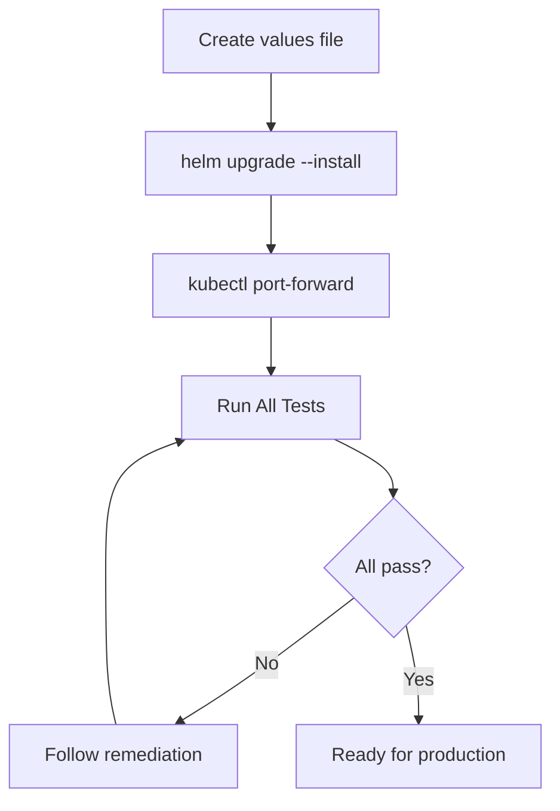

# Airia Infrastructure Test Pod - Deployment Guide

## Overview

The Airia Infrastructure Test Pod validates that your environment is ready for the main Airia application deployment. It tests connectivity and configuration for databases, storage, AI services, and Kubernetes components.

**Deployment Time: 5-10 minutes**

## Prerequisites

- Kubernetes cluster (v1.19+)
- Helm 3.x
- kubectl configured for your cluster
- Service credentials (databases, storage, AI endpoints)

## Quick Start

### Step 1: Download the Example Values File

```bash
curl -sSL https://raw.githubusercontent.com/davidpacold/airia-test-pod/main/helm/airia-test-pod/examples/basic-values.yaml \
  -o my-values.yaml
```

Or see the [example values file](../../helm/airia-test-pod/examples/basic-values.yaml) directly.

### Step 2: Edit Your Configuration

Open `my-values.yaml` and:
1. Set `config.auth.password` and `config.auth.secretKey`
2. Enable the tests you need by setting `enabled: true`
3. Fill in your service credentials

### Step 3: Deploy with Helm

```bash
helm upgrade --install airia-test-pod \
  oci://ghcr.io/davidpacold/airia-test-pod/charts/airia-test-pod \
  -f my-values.yaml \
  --namespace airia --create-namespace
```

### Step 4: Access the Dashboard

```bash
# Port forward to access the web interface
kubectl port-forward -n airia svc/airia-test-pod 8080:80

# Open http://localhost:8080
# Login with the credentials from your values file
```

### Step 5: Run Tests

1. Click **"Run All Tests"**
2. Review results — passed, failed, or skipped
3. Follow remediation guidance for any failures
4. Re-run until all required services pass

---

## Deployment Flow



---

## Alternative: Docker for Local Testing

```bash
docker run -d -p 8080:8080 \
  -e AUTH_USERNAME=admin \
  -e AUTH_PASSWORD=changeme \
  ghcr.io/davidpacold/airia-test-pod:latest

# Access at http://localhost:8080
```

## Alternative: Raw Kubernetes Manifests

If you cannot use Helm directly:

```bash
helm template airia-test-pod \
  oci://ghcr.io/davidpacold/airia-test-pod/charts/airia-test-pod \
  -f my-values.yaml \
  --output-dir ./rendered-manifests

kubectl apply -R -f ./rendered-manifests/
```

---

## SSL Certificate Chain Testing

The SSL test validates complete certificate chains, similar to `openssl s_client -connect domain.com:443 -showcerts`.

**What it detects:**
- Missing intermediate certificates
- Self-signed certificates
- Certificate chain completeness and continuity
- Hostname/SAN matching
- Certificate expiration (configurable warning threshold)
- Weak signature algorithms (MD5, SHA1)

---

## Monitoring and Troubleshooting

### Health Check

```bash
curl http://localhost:8080/health
```

### View Logs

```bash
kubectl logs -f -n airia -l app.kubernetes.io/name=airia-test-pod
kubectl describe pod -n airia -l app.kubernetes.io/name=airia-test-pod
```

### Common Issues

**Pod won't start:**
```bash
kubectl describe pod -n airia -l app.kubernetes.io/name=airia-test-pod
```

**Can't access the dashboard:**
```bash
kubectl port-forward -n airia svc/airia-test-pod 8080:80
# Open http://localhost:8080
```

**Configuration not taking effect:**
```bash
helm get values airia-test-pod -n airia
kubectl rollout restart -n airia deployment/airia-test-pod
```

### API Access

```bash
# Get token
TOKEN=$(curl -s -X POST http://localhost:8080/token \
  -H "Content-Type: application/x-www-form-urlencoded" \
  -d "username=admin&password=your-password" | jq -r '.access_token')

# Run all tests
curl -H "Authorization: Bearer $TOKEN" http://localhost:8080/api/tests/run-all

# Get results
curl -H "Authorization: Bearer $TOKEN" http://localhost:8080/api/tests/results
```

---

## Helm Management

```bash
# Check status
helm list -n airia

# View current configuration
helm get values airia-test-pod -n airia

# Upgrade to latest version
helm upgrade airia-test-pod \
  oci://ghcr.io/davidpacold/airia-test-pod/charts/airia-test-pod \
  -f my-values.yaml -n airia

# Rollback
helm rollback airia-test-pod -n airia

# Uninstall
helm uninstall airia-test-pod -n airia
```

---

## Security Notes

1. **Change default credentials** — never use defaults in production
2. **Rotate credentials** regularly
3. **Network policies** — restrict traffic if needed
4. **RBAC** — the pod uses minimal required permissions

---

## Next Steps

After successful validation:

1. Address any failed tests using the remediation suggestions
2. Re-run tests until all required services pass
3. Save your working configuration for reference
4. Contact Airia support to proceed with main application deployment

## Support

When contacting support, please include:
- Screenshot of test results
- Pod logs: `kubectl logs -n airia -l app.kubernetes.io/name=airia-test-pod`
- Your configuration (with sensitive data redacted)
