# Airia Infrastructure Test Pod - Deployment Guide

## Overview

The Airia Infrastructure Test Pod validates that your environment is ready for the main Airia application deployment. It tests connectivity and configuration for essential Azure services and Kubernetes components.

**⏱️ Deployment Time: 5-10 minutes**

## What Does It Test?

### Required Services
- **Azure PostgreSQL Flexible Server** - Connection validation, database listing, extension verification
- **Azure Blob Storage** - Authentication, upload/download operations, container access
- **Azure OpenAI** - API connectivity, completion endpoints, embedding endpoints
- **Kubernetes Storage** - Storage class availability, PVC creation permissions, read/write operations

### Optional Services
- **Azure Document Intelligence** - Document processing API
- **Self-hosted OpenAI-compatible models** - Local LLM deployments
- **Dedicated Embedding** - Standalone OpenAI-compatible embedding endpoints
- **SSL Certificate Chains** - Validates complete certificate chains

## Prerequisites

- Kubernetes cluster (v1.19+)
- Helm 3.x
- kubectl configured for your cluster
- Ingress controller (nginx recommended)
- Azure services configured

## Quick Start (Recommended)

### Step 1: Gather Your Information

Collect these details from your Azure and infrastructure team:

**Azure PostgreSQL:**
- Server hostname: `your-server.postgres.database.azure.com`
- Database username and password
- Database name (usually `postgres`)

**Azure Blob Storage:**
- Storage account name
- Storage account key
- Container name

**Azure OpenAI:**
- Endpoint URL: `https://your-openai.openai.azure.com/`
- API key
- Deployment name (e.g., `gpt-35-turbo`)

**Azure Document Intelligence (optional):**
- Endpoint URL: `https://your-doc-intel.cognitiveservices.azure.com/`
- API key

**Your Domain Names:**
- Choose hostnames where the test pod will be accessible
- Ensure DNS points to your Kubernetes ingress

### Step 2: Create Configuration File

Create a file called `my-test-values.yaml`:

```yaml
config:
  # Change these login credentials!
  auth:
    username: "admin"
    password: "ChangeThisPassword123!"
    secretKey: "change-this-jwt-secret-key-to-something-random"
  
  # Configure only the services you want to test
  postgresql:
    enabled: true  # Set to false to skip
    host: "your-server.postgres.database.azure.com"
    database: "postgres"
    username: "your-username"
    password: "your-password"
  
  blobStorage:
    enabled: true  # Set to false to skip
    accountName: "yourstorageaccount"
    accountKey: "your-storage-key"
    containerName: "test-container"
    
  azureOpenai:
    enabled: true  # Set to false to skip
    endpoint: "https://your-openai.openai.azure.com/"
    apiKey: "your-openai-key"
    chatDeployment: "gpt-35-turbo"
    
  documentIntelligence:
    enabled: false  # Set to true if you want to test this
    endpoint: "https://your-doc-intel.cognitiveservices.azure.com/"
    apiKey: "your-doc-intel-key"
    
  ssl:
    enabled: true  # Set to false to skip
    testUrls: "https://your-api-domain.com,https://your-app-domain.com"

# RECOMMENDED: Use external load balancer (Azure App Gateway, AWS ALB, CloudFlare)
# This is the simplest approach - no certificate management needed
ingress:
  enabled: false  # External load balancer handles routing

# Alternative: If using ingress controller (not recommended for SSL)
# ingress:
#   enabled: true
#   className: nginx
#   annotations:
#     nginx.ingress.kubernetes.io/ssl-redirect: "false"  # SSL handled externally
#     nginx.ingress.kubernetes.io/proxy-body-size: "10m"
#     # Optional: Increase timeout for long-running tests
#     # nginx.ingress.kubernetes.io/proxy-read-timeout: "300"
#     # nginx.ingress.kubernetes.io/proxy-send-timeout: "300"
#   hosts:
#     - host: airia-test.yourdomain.com
#       paths:
#         - path: /
#           pathType: Prefix
#   # No TLS section - handled by external load balancer

# Optional: Resource limits
resources:
  limits:
    cpu: 500m
    memory: 512Mi
  requests:
    cpu: 100m
    memory: 256Mi
```

### Step 3: Deploy with Helm

```bash
# Deploy the test pod
helm install airia-test-pod ./helm/airia-test-pod -f my-test-values.yaml

# Wait for it to start (takes 1-2 minutes)
kubectl get pods -n airia -w
```

### Step 4: Access and Test

1. Open your browser and go to: `https://airia-test.yourdomain.com`
2. Login with the username/password from your values file
3. Click **"Run All Tests"**
4. Watch the real-time results

### Deployment Flow

```mermaid
flowchart TD
    Gather["📋 Gather Information<br/>• Azure credentials<br/>• Domain names<br/>• Service endpoints"] 
    
    Config["📝 Create Configuration<br/>• my-test-values.yaml<br/>• Authentication settings<br/>• Service configurations"]
    
    Deploy["🚀 Deploy with Helm<br/>helm install airia-test-pod"]
    
    Verify["✅ Verify Deployment<br/>kubectl get pods<br/>kubectl get ingress"]
    
    Access["🌐 Access Dashboard<br/>Open your-domain.com"]
    
    Test["🧪 Run Tests<br/>Click 'Run All Tests'"]
    
    Results["📊 Review Results<br/>• Passed services ✅<br/>• Failed services ❌<br/>• Remediation steps"]
    
    Fix["🔧 Fix Issues<br/>Follow remediation<br/>suggestions"]
    
    Retest["🔄 Re-run Tests<br/>Until all pass"]
    
    Complete["🎉 Ready for Production<br/>Contact Airia support"]
    
    Gather --> Config
    Config --> Deploy
    Deploy --> Verify
    Verify --> Access
    Access --> Test
    Test --> Results
    Results -->|Issues Found| Fix
    Fix --> Retest
    Retest --> Results
    Results -->|All Tests Pass| Complete
```



## Alternative Deployment Methods

### Using Docker (Development/Testing)

For local testing or simple deployments:

```bash
# Build the image (if needed)
docker build -t airia/test-pod:latest .

# Run with environment variables
docker run -d \
  --name airia-test-pod \
  -p 8080:8080 \
  -e AUTH_USERNAME=admin \
  -e AUTH_PASSWORD=changeme \
  -e POSTGRES_HOST=your-server.postgres.database.azure.com \
  -e POSTGRES_USER=your-username \
  -e POSTGRES_PASSWORD=your-password \
  -e BLOB_ACCOUNT_NAME=yourstorageaccount \
  -e BLOB_ACCOUNT_KEY=your-storage-key \
  -e OPENAI_ENDPOINT=https://your-openai.openai.azure.com/ \
  -e OPENAI_API_KEY=your-openai-key \
  airia/test-pod:latest

# Access at http://localhost:8080
```

### Using Raw Kubernetes Manifests

If you cannot use Helm:

```bash
# Create namespace
kubectl apply -f k8s/namespace.yaml

# Configure secrets (edit these files first!)
kubectl apply -f k8s/secret-example.yaml
kubectl apply -f k8s/postgres-secret-example.yaml
kubectl apply -f k8s/blob-secret-example.yaml
kubectl apply -f k8s/openai-secret-example.yaml

# Deploy application
kubectl apply -f k8s/rbac.yaml
kubectl apply -f k8s/configmap-example.yaml
kubectl apply -f k8s/deployment.yaml
kubectl apply -f k8s/service.yaml
kubectl apply -f k8s/ingress.yaml
```

## Understanding Test Results

| Status | Icon | Meaning |
|--------|------|---------|
| **Passed** | ✅ | Service is correctly configured |
| **Warning** | ⚠️ | Service works but has non-critical issues |
| **Failed** | ❌ | Service has critical issues that need fixing |
| **Timeout** | 🔄 | Service didn't respond in time |
| **Permission Denied** | 🚫 | Insufficient permissions |
| **Skipped** | ⏭️ | Optional service not configured (normal) |

### Test Execution Flow

```mermaid
flowchart TD
    Start(["User clicks 'Run Tests'"]) --> Auth{"Authentication Valid?"}
    Auth -->|No| Login["Redirect to Login"]
    Auth -->|Yes| Config{"Check Configuration"}
    
    Config -->|PostgreSQL Enabled| PG["Test PostgreSQL Connection"]
    Config -->|Blob Storage Enabled| Blob["Test Blob Storage"]
    Config -->|OpenAI Enabled| AI["Test OpenAI API"]
    Config -->|SSL Enabled| SSL["Test SSL Certificates"]
    Config -->|PVC Enabled| PVC["Test Kubernetes PVC"]
    
    PG --> PGResult{"Result"}
    Blob --> BlobResult{"Result"}
    AI --> AIResult{"Result"}
    SSL --> SSLResult{"Result"}
    PVC --> PVCResult{"Result"}
    
    PGResult -->|✅| PGPass["Mark as Passed"]
    PGResult -->|❌| PGFail["Mark as Failed + Remediation"]
    
    BlobResult -->|✅| BlobPass["Mark as Passed"]
    BlobResult -->|❌| BlobFail["Mark as Failed + Remediation"]
    
    AIResult -->|✅| AIPass["Mark as Passed"]
    AIResult -->|❌| AIFail["Mark as Failed + Remediation"]
    
    SSLResult -->|✅| SSLPass["Mark as Passed"]
    SSLResult -->|❌| SSLFail["Mark as Failed + Remediation"]
    
    PVCResult -->|✅| PVCPass["Mark as Passed"]
    PVCResult -->|❌| PVCFail["Mark as Failed + Remediation"]
    
    PGPass --> Summary["Generate Test Summary"]
    PGFail --> Summary
    BlobPass --> Summary
    BlobFail --> Summary
    AIPass --> Summary
    AIFail --> Summary
    SSLPass --> Summary
    SSLFail --> Summary
    PVCPass --> Summary
    PVCFail --> Summary
    
    Summary --> WebSocket["Send Real-time Updates"]
    WebSocket --> Dashboard["Update Dashboard"]
```



## Common Issues and Solutions

### PostgreSQL Connection Failed
```
Error: connection refused
Solutions: 
1. Verify firewall rules allow connection from cluster
2. Check if server allows connections from Azure services
3. Ensure SSL mode is set correctly
4. Verify hostname format: server.postgres.database.azure.com
```

### Blob Storage Authentication Failed
```
Error: 403 Forbidden
Solutions:
1. Verify account key is correct and not expired
2. Check if IP restrictions are blocking cluster
3. Ensure container exists and has proper permissions
4. Test account key with Azure Storage Explorer
```

### OpenAI API Errors
```
Error: 401 Unauthorized or 404 Not Found
Solutions:
1. Verify API key is correct
2. Check endpoint format: https://name.openai.azure.com/
3. Ensure deployment name matches your Azure OpenAI deployment
4. Check API version compatibility
```

### PVC Creation Failed
```
Error: forbidden: cannot create persistentvolumeclaims
Solutions:
1. Verify RBAC permissions (automatic with Helm)
2. Check if storage class exists: kubectl get storageclass
3. Verify namespace resource quotas
```

### SSL Certificate Issues
```
Error: certificate chain incomplete
Solutions:
1. Ensure certificate chain is complete
2. Check certificate expiration dates
3. Verify hostname matches certificate
4. Test with: openssl s_client -connect hostname:443
```

## Configuration Reference

### Complete Values File Documentation

Below is a comprehensive reference for all configuration options available in your `values.yaml` file.

**Note:** For the most up-to-date configuration options, always refer to [`helm/airia-test-pod/values.yaml`](helm/airia-test-pod/values.yaml).

```yaml
# =============================================================================
# DEPLOYMENT CONFIGURATION
# =============================================================================
replicaCount: 1                                         # Number of pod replicas

# Container Image Settings
image:
  repository: ghcr.io/davidpacold/airia-test-pod       # Container image repository
  pullPolicy: IfNotPresent                             # Pull policy: Always|IfNotPresent|Never
  tag: "latest"                                        # Image tag

imagePullSecrets: []                                   # List of image pull secrets
nameOverride: ""                                       # Override chart name
fullnameOverride: ""                                   # Override full release name

# =============================================================================
# AUTHENTICATION & SERVICE CONFIGURATIONS
# =============================================================================
config:
  auth:
    # Web UI login credentials (REQUIRED - CHANGE THESE!)
    username: "admin"                                  # Default: "admin"
    password: "changeme"                               # MUST CHANGE - Web UI password
    secretKey: "your-super-secret-key-change-this"     # MUST CHANGE - JWT signing key (min 32 chars)

  # PostgreSQL Database Testing
  postgresql:
    enabled: false                                     # Enable/disable PostgreSQL tests
    host: "your-postgres-server.postgres.database.azure.com"  # FQDN of PostgreSQL server
    port: "5432"                                       # Default: "5432"
    database: "postgres"                               # Target database name
    sslmode: "require"                                 # SSL mode: disable|allow|prefer|require|verify-ca|verify-full
    username: ""                                       # Database username
    password: ""                                       # Database password
    
  # Azure Blob Storage Testing  
  blobStorage:
    enabled: false                                     # Enable/disable Blob Storage tests
    accountName: ""                                    # Storage account name (without .blob.core.windows.net)
    accountKey: ""                                     # Primary or secondary access key
    containerName: "test-container"                    # Container name for test operations
    
  # Azure OpenAI Testing
  azureOpenai:
    enabled: false                                     # Enable/disable Azure OpenAI tests
    endpoint: "https://your-openai.openai.azure.com/"  # Azure OpenAI endpoint URL (must end with /)
    apiKey: ""                                         # Azure OpenAI API key
    chatDeployment: "gpt-35-turbo"                     # Chat model deployment name
    embeddingDeployment: ""                            # Optional embedding model deployment
    
  # Azure Document Intelligence (Optional)
  documentIntelligence:
    enabled: false                                     # Enable/disable Document Intelligence tests
    endpoint: "https://your-doc-intel.cognitiveservices.azure.com/"  # Doc Intel endpoint
    apiKey: ""                                         # Document Intelligence API key
    model: "prebuilt-document"                         # Model to use for testing
    
  # SSL Certificate Chain Testing
  ssl:
    enabled: false                                     # Enable/disable SSL certificate tests
    testUrls: "https://api.example.com,https://app.example.com"  # Comma-separated URLs to test
    connectTimeout: 10                                 # Connection timeout in seconds
    warningDays: 30                                    # Days before expiration to show warnings
    
  # Kubernetes Storage Testing
  kubernetes:
    storageClass: "default"                            # Storage class name
    testPvcSize: "1Gi"                                 # PVC size for test
    
  # S3 Compatible Storage (Optional)
  s3Compatible:
    enabled: false                                     # Enable/disable S3 compatible tests
    endpointUrl: "https://s3.example.com"              # S3-compatible endpoint URL
    accessKey: ""                                      # Access key
    secretKey: ""                                      # Secret key
    bucketName: "test-bucket"                          # Bucket name for testing
    secure: true                                       # Use HTTPS
    
  # Amazon S3 Storage (Optional)
  s3:
    enabled: false                                     # Enable/disable S3 tests
    region: "us-east-1"                                # AWS region
    accessKeyId: ""                                    # AWS access key ID
    secretAccessKey: ""                                # AWS secret access key
    sessionToken: ""                                   # Optional for temporary credentials
    bucketName: "test-bucket"                          # S3 bucket name
    endpointUrl: ""                                    # Optional custom endpoint
    
# =============================================================================
# KUBERNETES DEPLOYMENT CONFIGURATION
# =============================================================================

# Service Account
serviceAccount:
  create: true                                         # Create service account (default: true)
  annotations: {}                                      # Additional annotations
  name: ""                                             # Service account name (empty = auto-generated)

# Pod Configuration
podAnnotations: {}                                     # Additional pod annotations
podSecurityContext: {}                                 # Pod security context (commented out by default)
  # fsGroup: 2000

securityContext: {}                                    # Container security context (commented out by default)
  # capabilities:
  #   drop:
  #   - ALL
  # readOnlyRootFilesystem: true
  # runAsNonRoot: true
  # runAsUser: 1000

# Service Configuration
service:
  type: ClusterIP                                      # Service type: ClusterIP|NodePort|LoadBalancer
  port: 80                                             # Service port
  targetPort: 8080                                     # Container port
  # nodePort: 30000                                    # Only used if type is NodePort

# Ingress Configuration
ingress:
  enabled: false                                       # Enable ingress (default: false)
  className: "nginx"                                   # Ingress class name
  annotations:                                         # Ingress annotations
    nginx.ingress.kubernetes.io/ssl-redirect: "false"
    nginx.ingress.kubernetes.io/proxy-body-size: "10m"
  hosts:
    - host: test.example.com                           # Example hostnames (up to 5 supported)
      paths:
        - path: /
          pathType: Prefix
    - host: readiness.example.com
      paths:
        - path: /
          pathType: Prefix
    - host: infra-test.example.com
      paths:
        - path: /
          pathType: Prefix
    - host: validation.example.com
      paths:
        - path: /
          pathType: Prefix
    - host: precheck.example.com
      paths:
        - path: /
          pathType: Prefix
  tls:
    - secretName: airia-test-pod-tls
      hosts:
        - test.example.com
        - readiness.example.com
        - infra-test.example.com
        - validation.example.com
        - precheck.example.com

# Resource Limits and Requests
resources:
  limits:
    cpu: 500m                                          # CPU limit (millicores)
    memory: 512Mi                                      # Memory limit
  requests:
    cpu: 100m                                          # CPU request (millicores)
    memory: 256Mi                                      # Memory request

# Autoscaling Configuration
autoscaling:
  enabled: false                                       # Enable HPA (default: false)
  minReplicas: 1                                       # Minimum replicas
  maxReplicas: 100                                     # Maximum replicas
  targetCPUUtilizationPercentage: 80                   # CPU target percentage
  # targetMemoryUtilizationPercentage: 80              # Memory target percentage (optional)

# Node Selection and Scheduling
nodeSelector: {}                                       # Node selector labels
tolerations: []                                        # Pod tolerations
affinity: {}                                           # Pod affinity/anti-affinity

# Namespace Configuration
namespace:
  create: false                                        # Create namespace (default: false)
  name: "airia-preprod"                                # Namespace name
```

### Enhanced SSL Certificate Chain Validation

The SSL test provides comprehensive certificate chain analysis similar to:
`openssl s_client -connect domain.com:443 -showcerts`

**What it detects:**
- ✓ Missing intermediate certificates (common misconfiguration)
- ✓ Self-signed certificates  
- ✓ Certificate chain completeness
- ✓ Certificate Authority (CA) flag validation
- ✓ Certificate chain continuity (each cert signed by next)
- ✓ Hostname/SAN matching
- ✓ Certificate expiration with configurable warnings
- ✓ Weak signature algorithms (MD5, SHA1)

**Common SSL issues detected:**
- "Certificate chain appears incomplete - no intermediate certificates found"
- "This may cause SSL/TLS validation failures for some clients" 
- Server certificates marked as CA certificates (security issue)
- Chain breaks (certificate not signed by expected issuer)
- Self-signed certificates in production environments

### Configuration Examples

**Minimal Configuration (Required Services Only):**
```yaml
config:
  auth:
    username: "admin"
    password: "SecurePassword123!"
    secretKey: "your-random-jwt-secret-key-32-chars-min"
  postgresql:
    enabled: true
    host: "your-server.postgres.database.azure.com"
    username: "postgres_user"
    password: "postgres_password"
  blobStorage:
    enabled: true
    accountName: "yourstorageaccount"
    accountKey: "your-storage-key"
    containerName: "test-container"
  azureOpenai:
    enabled: true
    endpoint: "https://your-openai.openai.azure.com/"
    apiKey: "your-openai-key"
    chatDeployment: "gpt-35-turbo"

ingress:
  enabled: true
  className: nginx
  hosts:
    - host: airia-test.yourdomain.com
      paths:
        - path: /
          pathType: Prefix
```

**Complete Example with All Services:**
See [`Test deploy/values-example.yaml`](Test%20deploy/values-example.yaml) for a comprehensive example with all available services and options.

## Advanced Configuration

### Ingress Configuration

The test pod uses WebSocket connections for real-time updates. By default, SSL redirect is disabled as the pod expects HTTP traffic with TLS termination handled by external load balancers or ingress controllers.

#### NGINX Ingress Controller (Most Common)

**Basic NGINX Configuration:**
```yaml
ingress:
  enabled: true
  className: "nginx"
  annotations:
    nginx.ingress.kubernetes.io/ssl-redirect: "false"
    nginx.ingress.kubernetes.io/proxy-body-size: "10m"
    nginx.ingress.kubernetes.io/proxy-read-timeout: "300"
    nginx.ingress.kubernetes.io/proxy-send-timeout: "300"
  hosts:
    - host: airia-test.yourdomain.com
      paths:
        - path: /
          pathType: Prefix
  tls:
    - secretName: airia-test-tls
      hosts:
        - airia-test.yourdomain.com
```

**NGINX with Cert-Manager (Automatic TLS):**
```yaml
ingress:
  enabled: true
  className: "nginx"
  annotations:
    nginx.ingress.kubernetes.io/ssl-redirect: "false"
    nginx.ingress.kubernetes.io/proxy-body-size: "10m"
    # Automatic TLS certificate generation
    cert-manager.io/cluster-issuer: "letsencrypt-prod"
    # Optional: Force HTTPS redirect after cert is issued
    # nginx.ingress.kubernetes.io/ssl-redirect: "true"
  hosts:
    - host: airia-test.yourdomain.com
      paths:
        - path: /
          pathType: Prefix
  tls:
    - secretName: airia-test-tls-auto  # cert-manager will create this
      hosts:
        - airia-test.yourdomain.com
```


#### AWS Application Load Balancer (ALB) Ingress

**AWS ALB Configuration:**
```yaml
ingress:
  enabled: true
  className: "alb"  # or "aws-load-balancer"
  annotations:
    kubernetes.io/ingress.class: alb
    alb.ingress.kubernetes.io/scheme: internet-facing
    alb.ingress.kubernetes.io/target-type: ip
    alb.ingress.kubernetes.io/backend-protocol: HTTP
    # SSL configuration
    alb.ingress.kubernetes.io/listen-ports: '[{"HTTP": 80}, {"HTTPS": 443}]'
    alb.ingress.kubernetes.io/ssl-redirect: '443'
    # Certificate from AWS Certificate Manager
    alb.ingress.kubernetes.io/certificate-arn: arn:aws:acm:us-west-2:123456789012:certificate/12345678-1234-1234-1234-123456789012
    # Health check configuration
    alb.ingress.kubernetes.io/healthcheck-path: /health
    alb.ingress.kubernetes.io/healthcheck-protocol: HTTP
  hosts:
    - host: airia-test.yourdomain.com
      paths:
        - path: /
          pathType: Prefix
  # No tls section needed when using ACM certificates
```

**AWS ALB with Multiple Certificates:**
```yaml
ingress:
  enabled: true
  className: "alb"
  annotations:
    kubernetes.io/ingress.class: alb
    alb.ingress.kubernetes.io/scheme: internet-facing
    alb.ingress.kubernetes.io/target-type: ip
    alb.ingress.kubernetes.io/backend-protocol: HTTP
    alb.ingress.kubernetes.io/listen-ports: '[{"HTTP": 80}, {"HTTPS": 443}]'
    alb.ingress.kubernetes.io/ssl-redirect: '443'
    # Multiple certificates for different domains
    alb.ingress.kubernetes.io/certificate-arn: |
      arn:aws:acm:us-west-2:123456789012:certificate/cert1-uuid,
      arn:aws:acm:us-west-2:123456789012:certificate/cert2-uuid
  hosts:
    - host: airia-test.company.com
      paths:
        - path: /
          pathType: Prefix
    - host: infra-check.company.com
      paths:
        - path: /
          pathType: Prefix
```

#### MetalLB Load Balancer (On-Premises/Bare Metal)

**MetalLB with NGINX Ingress:**
```yaml
# Service configuration for MetalLB
service:
  type: LoadBalancer  # This will get an external IP from MetalLB
  port: 80
  targetPort: 8080
  annotations:
    metallb.universe.tf/loadBalancerIPs: "192.168.1.100"  # Optional: specify IP
    # metallb.universe.tf/address-pool: production  # Optional: specify IP pool

ingress:
  enabled: true
  className: "nginx"
  annotations:
    nginx.ingress.kubernetes.io/ssl-redirect: "false"
    nginx.ingress.kubernetes.io/proxy-body-size: "10m"
    nginx.ingress.kubernetes.io/proxy-read-timeout: "300"
    nginx.ingress.kubernetes.io/proxy-send-timeout: "300"
    # Optional: cert-manager integration
    cert-manager.io/cluster-issuer: "letsencrypt-prod"
  hosts:
    - host: airia-test.company.local
      paths:
        - path: /
          pathType: Prefix
  tls:
    - secretName: airia-test-metallb-tls
      hosts:
        - airia-test.company.local
```

**MetalLB with Direct LoadBalancer Service (No Ingress):**
```yaml
# Direct LoadBalancer service for simple setups
service:
  type: LoadBalancer
  port: 443  # HTTPS port
  targetPort: 8080
  annotations:
    metallb.universe.tf/loadBalancerIPs: "192.168.1.100"
    # For SSL termination at MetalLB (requires additional setup)
    service.beta.kubernetes.io/aws-load-balancer-ssl-cert: "arn:aws:iam::123456789012:server-certificate/test-cert"
    service.beta.kubernetes.io/aws-load-balancer-backend-protocol: "http"

# Disable ingress when using direct LoadBalancer
ingress:
  enabled: false

# You would access the app directly via the LoadBalancer IP
# https://192.168.1.100 or https://airia-test.company.local (with DNS)
```

**MetalLB Configuration File Example:**
```yaml
# Example MetalLB ConfigMap (for reference)
apiVersion: v1
kind: ConfigMap
metadata:
  namespace: metallb-system
  name: config
data:
  config: |
    address-pools:
    - name: production
      protocol: layer2
      addresses:
      - 192.168.1.100-192.168.1.110
    - name: development  
      protocol: layer2
      addresses:
      - 192.168.1.200-192.168.1.210
```

#### Other Ingress Controllers

**Traefik Configuration:**
```yaml
ingress:
  enabled: true
  className: "traefik"
  annotations:
    kubernetes.io/ingress.class: traefik
    traefik.ingress.kubernetes.io/router.tls: "true"
    traefik.ingress.kubernetes.io/router.middlewares: default-redirect-https@kubernetescrd
    # Timeout configuration
    traefik.ingress.kubernetes.io/router.timeout: "300s"
  hosts:
    - host: airia-test.yourdomain.com
      paths:
        - path: /
          pathType: Prefix
  tls:
    - secretName: airia-test-traefik-tls
      hosts:
        - airia-test.yourdomain.com
```

**HAProxy Configuration:**
```yaml
ingress:
  enabled: true
  className: "haproxy"
  annotations:
    kubernetes.io/ingress.class: haproxy
    haproxy.org/ssl-redirect: "true"
    haproxy.org/timeout-client: "300s"
    haproxy.org/timeout-server: "300s"
    # WebSocket support
    haproxy.org/server-ssl: "false"
    haproxy.org/path-rewrite: "/"
  hosts:
    - host: airia-test.yourdomain.com
      paths:
        - path: /
          pathType: Prefix
  tls:
    - secretName: airia-test-haproxy-tls
      hosts:
        - airia-test.yourdomain.com
```

#### SSL Termination: External vs Internal

**RECOMMENDED: External SSL Termination (Outside Kubernetes)**

Having SSL handled by external infrastructure (AWS ALB, CloudFlare, cloud load balancers, etc.) is generally **better and simpler**:

**Benefits:**
- ✅ **Simpler Configuration**: No certificate management in Kubernetes
- ✅ **Better Performance**: SSL offloading at the edge
- ✅ **Centralized Management**: All certificates managed in one place
- ✅ **Auto-Renewal**: Cloud providers handle certificate lifecycle
- ✅ **Less Complexity**: No secrets, cert-manager, or ingress TLS config
- ✅ **Security**: Certificates stay in cloud key vaults/certificate stores

**Example: External Load Balancer with SSL**
```yaml
# Simplified configuration - no TLS management needed
service:
  type: ClusterIP  # Internal traffic only
  port: 80
  targetPort: 8080

ingress:
  enabled: false  # Not needed when using external load balancer

# Alternative: Simple ingress without TLS (if using nginx internally)
ingress:
  enabled: true
  className: "nginx"
  annotations:
    nginx.ingress.kubernetes.io/ssl-redirect: "false"  # SSL handled externally
    nginx.ingress.kubernetes.io/proxy-body-size: "10m"
  hosts:
    - host: airia-test.yourdomain.com
      paths:
        - path: /
          pathType: Prefix
  # No tls section - handled by external load balancer
```

**Example: AWS ALB with ACM Certificates**
```yaml
# Even simpler with AWS - just use ALB directly
service:
  type: NodePort  # Or ClusterIP if using target type 'ip'
  port: 80
  targetPort: 8080

ingress:
  enabled: false  # ALB handles everything externally

# Access directly via ALB DNS name or custom domain
# SSL certificates managed in AWS Certificate Manager
# Auto-renewal handled by AWS
```

**Example: CloudFlare + Any Load Balancer**
```yaml
# Simplest setup - CloudFlare handles SSL, any backend
service:
  type: LoadBalancer  # Or NodePort, or even port-forward for testing
  port: 80
  targetPort: 8080

ingress:
  enabled: false

# CloudFlare handles:
# - SSL termination
# - Certificate auto-renewal
# - DDoS protection
# - Caching
# Just point CloudFlare to your cluster IP/domain
```

**Important Notes:**
- **WebSocket Support**: WebSocket connections for real-time updates work automatically with most ingress controllers
- **Timeout Settings**: Increase timeouts for long-running tests (some tests can take 60+ seconds)
- **SSL Termination**: The pod expects HTTP traffic - TLS termination should happen externally
- **Recommended Approach**: Use cloud-native certificate and load balancer services when available

### Multiple Hostname Support

The ingress supports up to 5 different hostnames:

```yaml
ingress:
  hosts:
    - host: test.public.company.com
      paths:
        - path: /
          pathType: Prefix
    - host: readiness.internal.company.com
      paths:
        - path: /
          pathType: Prefix
    - host: infra-check.dev.company.com
      paths:
        - path: /
          pathType: Prefix
  tls:
    - hosts:
        - test.public.company.com
      secretName: public-tls
    - hosts:
        - readiness.internal.company.com
        - infra-check.dev.company.com
      secretName: internal-tls
```

### Optional Service Configuration

Enable optional services by setting `enabled: true`:

```yaml
config:
  # Azure Document Intelligence
  documentIntelligence:
    enabled: true
    endpoint: "https://your-doc-intel.cognitiveservices.azure.com/"
    apiKey: "your-api-key"
  
  # Dedicated Embedding (OpenAI-compatible)
  dedicatedEmbedding:
    enabled: true
    baseUrl: "http://embedding-server:1234/v1"
    model: "text-embedding-model"
```

## Monitoring and Troubleshooting

### Health Check
```bash
curl -k https://your-domain.com/health
```

Expected response:
```json
{
  "status": "healthy",
  "timestamp": "2024-01-01T12:00:00.000000",
  "version": "1.0.0"
}
```

### View Logs
```bash
# Follow application logs
kubectl logs -f -n airia -l app.kubernetes.io/name=airia-test-pod

# Check pod status and events
kubectl describe pod -n airia -l app.kubernetes.io/name=airia-test-pod

# Check ingress status
kubectl get ingress -n airia
kubectl describe ingress -n airia airia-test-pod
```

### Common Troubleshooting Commands

**Pod Won't Start:**
```bash
kubectl describe pod -n airia -l app.kubernetes.io/name=airia-test-pod
kubectl logs -n airia -l app.kubernetes.io/name=airia-test-pod
```

**Can't Access Web UI:**
```bash
# Test with port-forward
kubectl port-forward -n airia svc/airia-test-pod 8080:80
# Then open http://localhost:8080

# Check ingress controller
kubectl get pods -n ingress-nginx
```

**Authentication Issues:**
```bash
# Verify secret exists
kubectl get secret -n airia -l app.kubernetes.io/name=airia-test-pod
```

### API Access (Alternative to Web UI)

```bash
# Get authentication token
TOKEN=$(curl -X POST https://your-domain.com/token \
  -H "Content-Type: application/x-www-form-urlencoded" \
  -d "username=admin&password=your-password" | jq -r '.access_token')

# Run all tests
curl -H "Authorization: Bearer $TOKEN" https://your-domain.com/api/tests/run-all

# Run specific test
curl -H "Authorization: Bearer $TOKEN" https://your-domain.com/api/tests/postgres

# Get results
curl -H "Authorization: Bearer $TOKEN" https://your-domain.com/api/tests/results
```

## Security Considerations

1. **Change Default Credentials** - Never use default passwords in production
2. **Use Kubernetes Secrets** - Store sensitive data in secrets, not ConfigMaps
3. **Enable TLS** - Always use HTTPS for external access
4. **Network Policies** - Implement to restrict traffic if needed
5. **RBAC** - The pod uses minimal required permissions
6. **Regular Updates** - Keep the test pod image updated

## Helm Management

### Common Helm Operations

```bash
# Check installation status
helm list -n airia-preprod

# View current configuration
helm get values airia-test-pod -n airia-preprod

# Upgrade to new version
helm upgrade airia-test-pod ./helm/airia-test-pod -f my-test-values.yaml

# Rollback if needed
helm rollback airia-test-pod -n airia-preprod

# Uninstall
helm uninstall airia-test-pod -n airia
```

### Using External Secrets

For production environments, store secrets externally:

```bash
# Create secrets manually
kubectl create secret generic azure-credentials \
  --from-literal=postgres-password='your-password' \
  --from-literal=blob-key='your-key' \
  --from-literal=openai-key='your-key' \
  -n airia-preprod

# Reference in values.yaml
azure:
  postgres:
    existingSecret: azure-credentials
    passwordKey: postgres-password
```

## Cleanup

### Remove Test Pod
```bash
# Helm installation
helm uninstall airia-test-pod -n airia

# Raw Kubernetes manifests
kubectl delete -f k8s/ -n airia

# Docker container
docker stop airia-test-pod && docker rm airia-test-pod

# Optional: Remove namespace
kubectl delete namespace airia
```

## Next Steps

After successful validation:

1. **Address any failed tests** using the remediation suggestions
2. **Re-run tests** until all required services pass
3. **Save your working configuration** for reference
4. **Contact Airia support** to proceed with main application deployment

## Support

When contacting support, please include:
- Screenshot of test results
- Pod logs: `kubectl logs -n airia -l app.kubernetes.io/name=airia-test-pod`
- Your configuration (with sensitive data redacted)

---

**Architecture Overview:**

```mermaid
graph LR
    Customer["🏢 Customer Network<br/>• SSL Certs<br/>• DNS<br/>• Firewalls"]
    
    TestPod["☸️ Test Pod (Kubernetes)<br/>• Web Dashboard<br/>• Test Engine<br/>• WebSocket<br/>• RBAC"]
    
    Azure["☁️ Azure Services<br/>• PostgreSQL<br/>• Blob Storage<br/>• OpenAI<br/>• Doc Intel"]
    
    Customer <--> TestPod
    TestPod <--> Azure
```



Made with ❤️ by the Airia Team