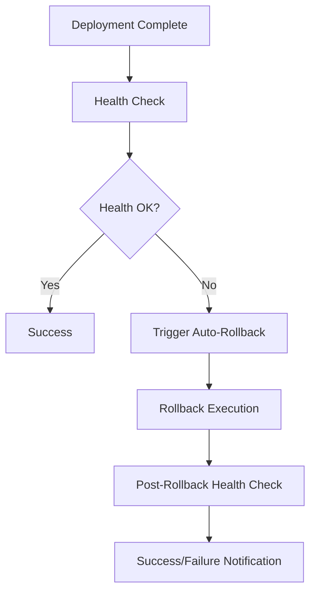

# 🔄 Rollback Strategy Documentation

## Overview

This document describes the automated rollback system for the airia-test-pod application. The rollback system provides both automatic and manual rollback capabilities to ensure rapid recovery from failed deployments.

## 🎯 Rollback Triggers

### Automatic Rollback
- **Post-deployment health check failures**: After each release, health checks run for 5 minutes
- **Application startup failures**: If the application fails to start within the expected timeframe
- **Critical service failures**: When essential services (database, storage) become unreachable

### Manual Rollback
- **Production incidents**: When issues are discovered after deployment
- **Performance degradation**: When the new version shows unacceptable performance
- **User-reported critical bugs**: When critical functionality is broken
- **Security incidents**: When security vulnerabilities are discovered

## 🚀 Rollback Workflows

### Automatic Rollback Process

1. **Trigger Detection**: Release workflow detects health check failure
2. **Rollback Initiation**: Automatic rollback workflow is triggered
3. **Validation**: Pre-rollback validation checks current and target states
4. **Execution**: Helm rollback is performed
5. **Health Verification**: Post-rollback health checks ensure success
6. **Notification**: Team is notified of rollback completion



### Manual Rollback Process

#### Using GitHub Actions UI

1. Navigate to **Actions** tab in GitHub repository
2. Select **🔄 Rollback Deployment** workflow
3. Click **Run workflow**
4. Fill in required parameters:
   - **Namespace**: Kubernetes namespace (default: `default`)
   - **Release name**: Helm release name (default: `airia-test-pod`)
   - **Revision**: Target revision (leave empty for previous)
   - **Reason**: Description of why rollback is needed
   - **Health check timeout**: Timeout in seconds (default: 300)

#### Using GitHub CLI

```bash
# Rollback to previous version
gh workflow run rollback.yml \
  --field namespace=default \
  --field release_name=airia-test-pod \
  --field reason="Critical bug in user authentication"

# Rollback to specific revision
gh workflow run rollback.yml \
  --field namespace=default \
  --field release_name=airia-test-pod \
  --field revision=3 \
  --field reason="Rollback to stable version 1.2.1"
```

#### Direct Kubernetes/Helm Commands

```bash
# Check current deployment status
kubectl get deployment airia-test-pod -n airia
kubectl rollout status deployment/airia-test-pod -n airia

# View Helm release history
helm history airia-test-pod -n airia

# Rollback to previous version
helm rollback airia-test-pod -n airia

# Rollback to specific revision
helm rollback airia-test-pod 3 -n airia

# Verify rollback success
kubectl rollout status deployment/airia-test-pod -n airia
kubectl exec deployment/airia-test-pod -n airia -- curl -f http://localhost:8080/health/live
```

## 🏥 Health Check Validation

The rollback system uses comprehensive health checks to validate deployment success:

### Health Endpoints
- **`/health/live`**: Basic liveness check - is the application running?
- **`/health/ready`**: Readiness check - can the application handle requests?
- **`/health`**: Comprehensive health check with detailed status

### Health Check Components
- **Application Startup**: Validates basic application functionality
- **Database Connectivity**: Checks PostgreSQL and Cassandra connections
- **External Dependencies**: Validates Azure Blob, MinIO, S3 connectivity
- **System Resources**: Monitors memory usage and disk space
- **Configuration**: Validates all required settings are present

### Health Check Timing
- **Startup Probe**: 5-12 attempts with 5-second intervals (up to 60 seconds)
- **Liveness Probe**: Every 30 seconds with 10-second timeout
- **Readiness Probe**: Every 15 seconds with 5-second timeout
- **Post-deployment**: 5-minute validation period with 30-second intervals

## 📊 Rollback Scenarios

### Database Migration Rollbacks

**Scenario**: Database migrations fail or cause data issues

**Action Steps**:
1. Rollback application to previous version
2. Rollback database migrations if needed
3. Validate data integrity
4. Re-run health checks

**Commands**:
```bash
# Rollback application
helm rollback airia-test-pod -n airia

# Rollback database (if migrations were applied)
# This would be application-specific - check migration tools
kubectl exec deployment/airia-test-pod -n airia -- python -m alembic downgrade -1
```

### Configuration Rollbacks

**Scenario**: New configuration causes service failures

**Action Steps**:
1. Rollback to previous Helm release (includes configuration)
2. Verify configuration is restored
3. Restart pods to pick up old configuration
4. Validate functionality

### Storage/Dependency Issues

**Scenario**: External service changes cause connectivity issues

**Action Steps**:
1. Rollback application version
2. Verify external service connectivity
3. Update configuration if external services changed
4. Run comprehensive health checks

## 🔍 Rollback Validation

### Pre-Rollback Checks
- [ ] Current deployment is unhealthy
- [ ] Target rollback revision exists
- [ ] No ongoing maintenance operations
- [ ] Database is in consistent state

### Post-Rollback Validation
- [ ] Application starts successfully
- [ ] Health endpoints return healthy status
- [ ] Database connectivity restored
- [ ] External services accessible
- [ ] User-facing functionality works
- [ ] Performance metrics are normal

### Rollback Success Criteria
- All health checks pass for 5 consecutive minutes
- Application responds to user requests
- Critical business functionality is operational
- No error spikes in monitoring systems
- Database queries execute successfully

## 🚨 Rollback Troubleshooting

### Common Issues

#### Health Checks Still Failing After Rollback
1. Check if the issue exists in the previous version
2. Verify external dependencies (database, storage) are healthy
3. Check for infrastructure issues (networking, DNS)
4. Review application logs for specific errors

#### Rollback Timing Out
1. Increase health check timeout
2. Check resource constraints (CPU, memory)
3. Verify Kubernetes cluster health
4. Check for stuck or failing pods

#### Database Connection Issues
1. Verify database credentials in secrets
2. Check database service availability
3. Validate network policies and firewall rules
4. Test database connectivity manually

### Emergency Procedures

#### Complete Service Outage
```bash
# Immediate rollback without waiting
helm rollback airia-test-pod --force --no-hooks -n airia

# Scale to zero and back up (nuclear option)
kubectl scale deployment airia-test-pod --replicas=0 -n airia
kubectl scale deployment airia-test-pod --replicas=2 -n airia

# Check pod status
kubectl get pods -n airia -l app=airia-test-pod
```

#### Rollback Workflow Failure
```bash
# Manual Helm rollback
helm rollback airia-test-pod -n airia

# Check rollback status
helm status airia-test-pod -n airia
kubectl rollout status deployment/airia-test-pod -n airia

# Force restart pods if needed
kubectl rollout restart deployment/airia-test-pod -n airia
```

## 📋 Rollback Checklist

### Pre-Rollback
- [ ] Incident severity assessed
- [ ] Stakeholders notified
- [ ] Current system state documented
- [ ] Rollback target identified
- [ ] Impact assessment completed

### During Rollback
- [ ] Rollback initiated
- [ ] Progress monitored
- [ ] Health checks validated
- [ ] Error logs reviewed
- [ ] Team updated on progress

### Post-Rollback
- [ ] Service fully restored
- [ ] Health checks passing
- [ ] Users can access system
- [ ] Monitoring shows normal metrics
- [ ] Incident documentation updated
- [ ] Post-mortem scheduled

## 📞 Escalation Contacts

### Primary On-Call
- **GitHub Actions**: Check workflow runs and logs
- **Kubernetes**: `kubectl` access for direct intervention
- **Helm**: Release management and rollback execution

### Secondary Support
- **Database Team**: For database-related rollback issues
- **Infrastructure Team**: For cluster and networking issues
- **Security Team**: For security-related incidents

### Emergency Contacts
- **DevOps Lead**: For critical production issues
- **Engineering Manager**: For business impact decisions
- **Site Reliability**: For infrastructure emergencies

## 📚 Additional Resources

- **Helm Rollback Documentation**: https://helm.sh/docs/helm/helm_rollback/
- **Kubernetes Deployment Rollbacks**: https://kubernetes.io/docs/concepts/workloads/controllers/deployment/#rolling-back-a-deployment
- **Health Check Implementation**: See `app/health.py` for detailed health check logic
- **Monitoring Dashboards**: Access via internal monitoring systems
- **Incident Response Playbook**: See internal documentation

---

**Last Updated**: 2025-09-09  
**Next Review**: 2025-12-09  
**Document Owner**: DevOps Team